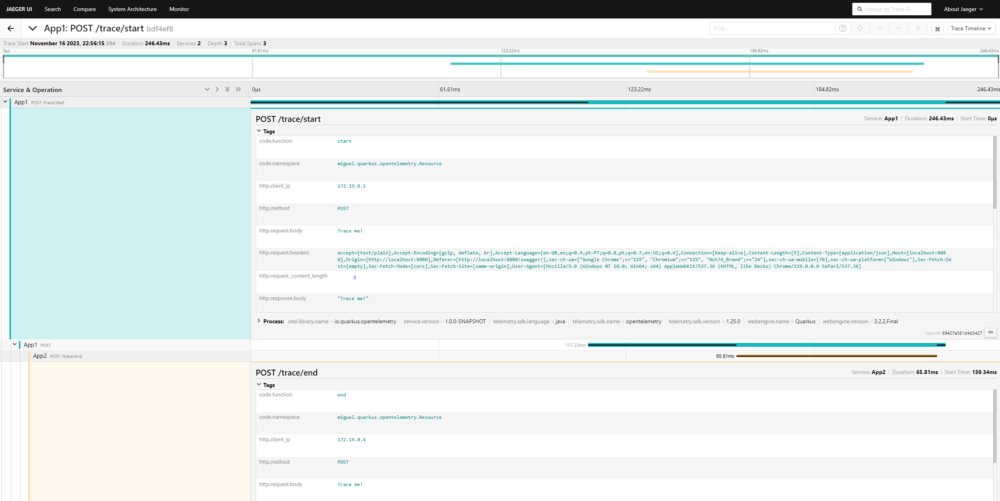

# opentelemetry-with-quarkus

Simple application integrated
with [quarkus open telemetry extension](https://quarkus.io/guides/opentelemetry).

The application is automatically instrumented to send http request/response traces to an
opentelemetry collector.

Additionally, all request/response headers and bodies are added to the traces through
a [custom implementation](https://github.com/miguel-oliveira/opentelemetry-with-quarkus/blob/master/src/main/java/miguel/quarkus/opentelemetry/RequestResponseInterceptor.java).

The Opentelemetry collector exports the tracing information to a Jaeger collector, which stores it
in an Elasticsearch instance.

A Jaeger Query and UI Service may then search the elasticsearch instance and present the stored
tracing information in the Jaeger UI.

## Architecture


## Usage

### Build and run

Both Maven and Docker are required in order to build and run this project.

Run the following commands in the project's root directory:

````shell
mvn package
````

````shell
docker-compose up
````

This will create and run the following containers:

* Two quarkus applications running at http://localhost:8080/swagger
  and http://localhost:8081/swagger
  with distinct names, App1 and App2 respectively. Both applications are instrumented to send
  tracing information to an opentelemetry collector;
* [An Opentelemetry Collector](https://opentelemetry.io/docs/collector/) which receives tracing
  information from the applications through a GRPC receiver and exports it to a Jaeger collector.
  Opentelemetry collector configuration file is
  available [here](https://github.com/miguel-oliveira/opentelemetry-with-quarkus/blob/main/otel-collector-config.yml);
* [A Jaeger collector](https://www.jaegertracing.io/docs/1.50/deployment/#collector) which receives
  the tracing information from the opentelemetry collector and stores it in an elasticsearch
  instance;
* [An Elasticsearch instance](https://www.elastic.co/elasticsearch) which stores the tracing
  information;
* [A Jaeger Query Service and UI](https://www.jaegertracing.io/docs/1.50/deployment/#query-service--ui)
  available
  at http://localhost:16686, which searches the tracing information in elasticsearch and presents it
  in the Jaeger UI;
* [A Kibana Dashboard](https://www.elastic.co/kibana) where you can manage your elasticsearch
  indices, run data analytics and much more. Available at http://localhost:5601.

### Perform a request and check the generated traces in Jaeger UI

* Access App1 API through http://localhost:8080/swagger
* Invoke the /trace/start endpoint
* App1 will then invoke App2 /trace/end endpoint and return its response
* Check the recorded traces by accessing http://localhost:16686
* Traces may be searched by trace id, which is available in the "trace-id" response header

### Example trace

